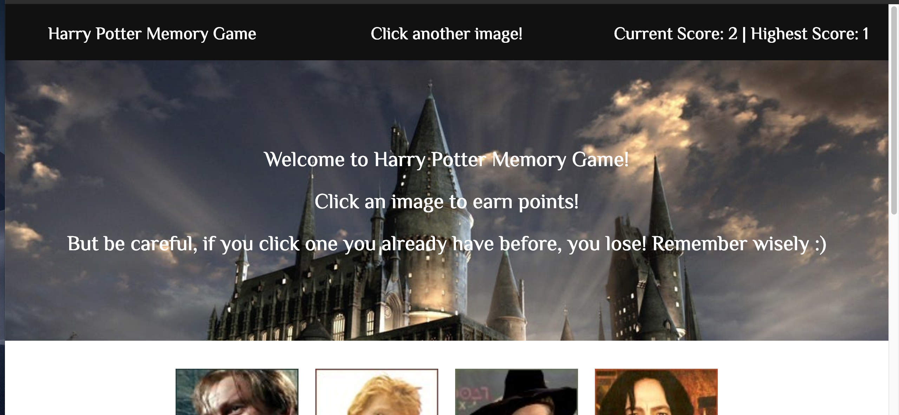

# Harry-Potter-Memory-Game

Live Link: https://rraj13.github.io/Harry-Potter-Memory-Game/

## Introduction
Hey there! Here I have created a Harry Potter-inspired Memory Game using React!. The goal of the game is to click each of the avatars only once, remembering which ones you have previously clicked. If a user clicks a character already clicked, the game restarts and the current score is set to 0. Highest score is also monitored and changed depending on the end score of the current game. Finally, to make the game more challenging, on each click the avatars are shuffled on the screen. 

## Technologies 
HTML 5 
CSS 3 
JavaScript 
React 

## General Methodology
This was my first project utilizing React on the frontend. Each part of interface was divided into components, following the React standard, and component states were monitored and manipulated in response to user events. Specifically, the app had states for current score, highest score and status, which was used to let the user know if they earned a point or lost the game. In addition, each avatar had a state of clicked or not clicked stored as a boolean, and the score state was updated depending on this click state. 

In building the app, I ran into some issues creating and using functions across various interface components, especially how and where to declare and manipulate states. After a bit of research and help from colleagues, I was able to master imports and props in order to successfully create the game. 

Moreover, shuffling the characters proved quite difficult. All character information is stored in it's own object which is turn stored in a "characters" array. It was quite a challenge to write an algorithm to shuffle the array elements but ultiamtely proved very beneficial in my coding and algorithm proficiency.

All in all, this project was a wonderful introduction to React and really showed me the power of this frontend framework.

Please take a look at the code and project and feel free to reach out with any questions!
